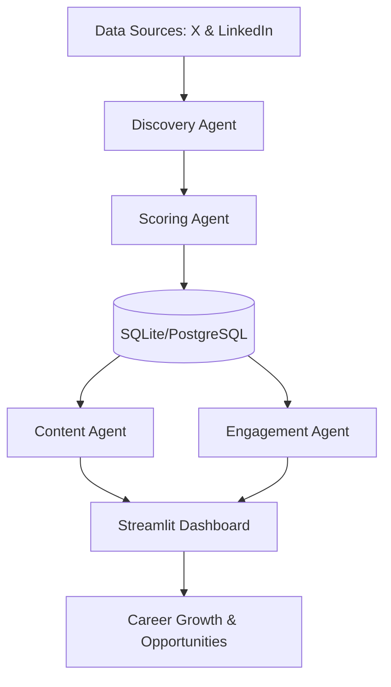

# 🚀 Fanikio — AI Personal Brand Growth System

**Fanikio** (Swahili for *Success*) is a powerful, AI-driven personal branding engine designed specifically for **Data Engineers, Analytics Professionals, and Tech Leaders**. 

It automates the tedious parts of growing a professional presence on **LinkedIn and X (Twitter)**, allowing you to focus on building skills while the system handles networking, content generation, and strategic engagement.

---

## 🎯 The Mission
In the modern job market, technical skills aren't enough—you need **visibility**. Fanikio helps you:
- **Discover** high-value connections (Recruiters, CTOs, Engineering Managers).
- **Prioritize** opportunities using data-driven scoring.
- **Create** technical content that demonstrates your expertise.
- **Engage** meaningfully with industry leaders to build genuine relationships.

---

## 🤖 The 5 Core AI Agents

Fanikio operates through a coordinated "crew" of AI agents, each specializing in a critical phase of professional growth:

### 1. 🔍 People Discovery Agent
Automatically scans X and LinkedIn to find the "right" people. It targets:
- Recruiters hiring for Data & AI roles.
- Founders and Engineering Managers at high-growth startups.
- Thought leaders in the dbt, Databricks, and Analytics ecosystem.

### 2. ⚖️ Opportunity Scoring Agent
Not all connections are equal. This agent uses a custom formula to rank leads:
- **40% Hiring Potential:** Are they actively recruiting?
- **25% Relevance:** Do they work in your specific tech stack?
- **20% Activity Level:** Are they active enough to notice your engagement?
- **15% Influence:** Can they amplify your reach?

### 3. ✍️ Content Creation Agent
Generates high-quality, human-sounding posts based on your learning journey. It focuses on 5 "Content Pillars":
- **What I Learned:** Insights from building data pipelines.
- **Mini Tutorials:** Explaining complex concepts (e.g., dbt layers, Spark optimization).
- **Project Breakdowns:** Showcasing your portfolio work.
- **Opinion Pieces:** Sharing your take on industry trends.
- **Career Journey:** Documenting your professional evolution.

### 4. 💬 Engagement Agent
Engagement is the "secret sauce" of growth. This agent finds trending posts from your top-ranked leads and suggests **thoughtful, value-add comments** to get you noticed by the right people.

### 5. 📊 Weekly Strategy Dashboard
A premium **Streamlit** interface that tracks your progress, visualizes your networking funnel, and suggests your content strategy for the upcoming week.

---

## 🏗️ Architecture & Workflow



---

## 🛠️ Tech Stack
- **Logic:** Python 3.x
- **UI:** Streamlit (Multi-page Dashboard)
- **Database:** SQLite (default) or PostgreSQL
- **AI:** OpenAI GPT / LangChain
- **Automation:** Selenium / Playwright for platform interactions

---

## 🚀 Getting Started

### 1. Clone & Install
```bash
git clone https://github.com/steodhiambo/Fanikio.git
cd Fanikio
pip install -r requirements.txt
```

### 2. Environment Setup
Copy the example environment file and fill in your API keys (OpenAI, X API, etc.):
```bash
cp .env.example .env
```

### 3. Initialize the System
Initialize the database (SQLite by default):
```bash
python main.py init
```

---

## 🎮 How to Use

You can run the full pipeline or individual agents:

| Command | Action |
| :--- | :--- |
| `python main.py all` | Run the complete discovery → scoring → content → engagement pipeline. |
| `python main.py discover` | Find new high-potential people on X. |
| `python main.py score` | Rank and score existing leads in the database. |
| `python main.py content` | Generate a fresh batch of LinkedIn and X posts. |
| `python main.py engage` | Suggest comments for today's networking goals. |
| `streamlit run dashboard/app.py` | **Launch the visual Command Center.** |

---

## 📈 Weekly Growth Goals

| Metric | Target |
| :--- | :--- |
| **New Connections** | 20+ quality leads / week |
| **Active Comments** | 30+ meaningful interactions / week |
| **Published Posts** | 3–5 high-value posts / week |
| **Visibility** | Increasing profile visits & recruiter inquiries |

---

## 🤝 Contributing
Contributions are welcome! Whether it's adding new agents, improving the UI, or optimizing the scoring algorithms, feel free to open a PR.

---

## 📄 License
MIT License. See [LICENSE](LICENSE) for details.
